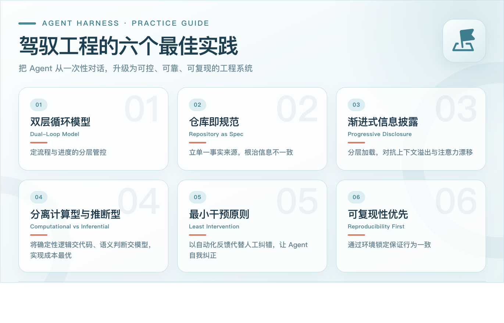
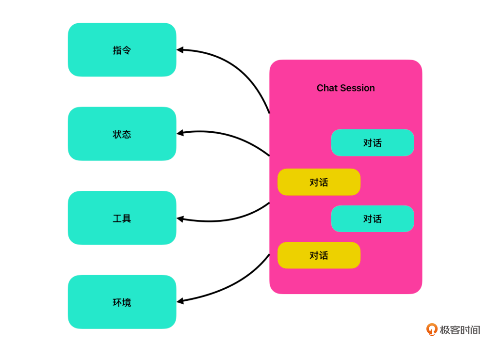
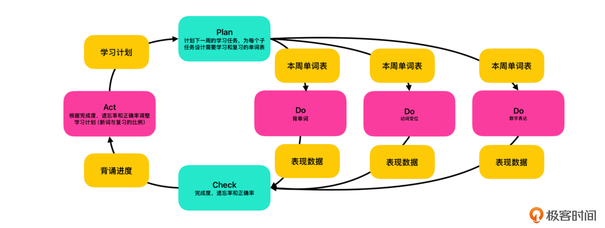

这篇记录来自极课时间，我获得了7天的免费阅读，这个国庆节抓紧多看几个专栏，但是匆匆阅读，并没记住多少，那就先整体记录起来 

# 04｜封装技能：把操控循环装进 SKILL


上一讲我们通过背单词的例子，搭建了一个完整的 Harness。其中我们使用了三个技能（Skill）：背单词（vocab-drill）、动词变位（conjugation-drill）和数字表达（number-drill）。对正常使用来说，这个 Harness 已经可以工作了。但作为设计者，你可能还不太清楚这些技能内部到底长什么样。那么今天我们就来仔细看一看这些技能是怎么实现的。

**什么是技能技能**

就是把操控循环（Steering Loop）打包成一个可以重复使用的单元。在当前的 Agent 实践中，技能通常是一个文件夹，其常见结构如下所示：

``` bash
my-skill/ 
├── SKILL.md # 必需的：元数据 + 操控循环说明 
├── scripts/ # 可选的：工具代码 
├── references/ # 可选的：参考资料 
└── assets/ # 可选的：模板文件
``` 


技能的根目录下必须包含一份 SKILL.md 文件。这个文件是技能的指令子系统，我们需要把前馈（Guides）、行动（Action）、反馈（Sensors）和调整（Steer）四个环节用自然语言写清楚（这些概念你可以看 01 讲复习）。Agent 读到后就知道按照什么流程来执行任务。在背单词的 Harness 中，我们有背单词、动词变位和数字表达三个技能。它们存在于 skills 目录中。首先，让我们来看一下背单词的技能（它的指令系统位于 skills/vocab-drill/SKILL.md）：
``` bash
--- 
name: vocab-drill 
description: 教新词并定期复习，使用 FSRS 记忆曲线。每个单词独立记录状态。 
allowed-tools: 
 - _shared/fsrs_scheduler.py 
--- 

# vocab-drill —— 背单词 
从 `plans/vocab/week-NN.md` 读取本周词汇，从 `state/vocab/` 读写进度。 
学习方式为**造句拼写**：展示中文含义，并提供一个包含该单词的中文例句，让用户翻译， 
根据句子意思是否通顺、目标单词是否使用正确来评分。 
当 phase 为 review 时，跳过获取新词，只做 FSRS 复习。 

**Guides**：读取 `state/vocab/progress.json` 获取已学单词状态， 
调用 `get_due_cards` 获取到期复习单词，调用 `get_next_new_words` 获取今日新词。 
**Action**：先复习到期单词，再学新词。教学时展示目标单词的西语拼写、中文含义和一个例句。 
测验时，提供一个含该单词含义的中文句子，用户用西语提供**包含该单词的完整翻译**。 
**Sensors**：判分依据两条： 
1. 句子意思是否和中文含义匹配 
2. 目标单词是否在句子中正确使用（时态、搭配、拼写） 
评分分为「完全正确」「大致正确」「错误」。 
**Steering**：连续错误的单词进入强化模式（多展示 2 个例句并要求重写一次）。FSRS自动调整复习间隔。
```


我们可以清楚地看到这个 skill 的操控循环，也可以看到它和其他背单词软件的关键区别：并不在意单个单词的记忆，而是要在句子翻译中准确地使用这个单词。这主要是因为西班牙语的阴阳性、单复数以及各种变位规则非常复杂。单单记住一个单词作用实在有限。这里我们利用的就是大模型的推理能力，根据单词构造句子让使用者翻译，并判断翻译的准确程度。这样的功能很难利用传统编码的方式实现。接下来让我们看看这个 SKILL.md 文件的几个关键点。

**技能的元数据**

首先是 SKILL.md 的格式。SKILL.md 分为元数据和正文两个部分。文件开头 --- 之间的部分是 Skill 的元数据，是 Agent Skill 的标准格式。它包含三个字段：

- name：技能的唯一标识符，AGENTS.md 中编排层通过这个名字来引用这个技能。当我们加载 vocab drill 时，编排层实际上是根据这里的 name 来做匹配的；

- description：对技能的自然语言描述。编排层在选择技能时，会根据 description 判断当前任务是否匹配。比如 AGENTS.md 中写“背单词”，编排层就会比对所有技能的 description，找到与“背单词”语义匹配的那个；

- allowed-tools：声明这个技能依赖的外部工具，这是一个可选项。通常可以指定 Agent 系统的内建工具，或是我们自己提供的工具。这里的 _shared/fsrs_scheduler.py 是一个被三个技能共同使用的共享工具。当 Agent 加载这个技能时，它会知道需要将 fsrs_scheduler.py 中的函数注册为可用工具，供操控循环的各个环节调用。


我们这个背单词的 Agent 需要在规定时间内记忆一定数量的单词，并且保证记住而不是背过就忘，那就要按记忆曲线复习已学过的单词。因此，我们需要这个工具来帮我们规划记忆曲线来做复习。我们使用的是自由间隔重复调度算法，FSRS（FSRS，Free Spaced Repetition Scheduler），这个 _shared/fsrs_scheduler.py 就是实现了这个调度算法的工具包。


- get_due_cards：获取今天到期的复习条目；
- update_card：根据评分更新 FSRS 状态；
- get_stats：返回掌握率、遗忘率等统计数据；
- get_next_new_words：根据当前计划挑选今天的新词。

这是一个典型的计算型控制。FSRS 的间隔计算是确定性的，同样的输入产生同样的输出，不应该让大模型推理。这也生动地回答了前面章节提出的问题：什么逻辑应该放进工具、什么逻辑应该留在提示词中？推断型的判断大模型处理起来更有效率，比如翻译的是否有效，而计算型采用工具的方式更好。

**与工具子系统的交互**

有了工具定义，那么该如何使用这些工具呢？当然是在操控循环中与工具交互了。进入正文部分，你会发现操控循环的很多环节都需要工具子系统。比如在前馈部分：

```bash
读取 `state/vocab/progress.json` 获取已学单词状态， 
调用 `get_due_cards` 获取到期复习单词，调用 `get_next_new_words` 获取今日新词。
```

就明确说明要使用工具 get_due_cards 和 get_next_new_words 确定今天要做什么。当然，我们也可以不明确写出要调用什么工具，比如在反馈阶段：

```
**Steering**：连续错误的单词进入强化模式（多展示 2 个例句并要求重写一次）。FSRS自动调整复习间隔。
```

我们就没有告诉 Agent 到底要调用哪个工具来自动调整复习时间。这就要依靠 Agent 的推理能力了。其大致的推理链条是这样的：

``` bash
现在 Sensors 阶段结束了，我有了一个评分 
 -> Steering 阶段要求 FSRS 调整复习间隔 
 -> FSRS 要知道评分才能计算 
 -> 工具里有一个 update_card 函数，它的参数是 progress、word_id 和 rating  
 -> 我应该调用它，把评分传给 FSRS。
```

同样，对于前馈我们也可以完全依赖 Agent 的推理能力，获取当前状态和要学习的单词。只不过这里我选择给出另一种写法而已。顺便说一句，这种写法某种程度上能节约一点点词元（token），不过坏处就是一旦工具包里的内容改变了，还需要手动修改这里的引用的工具。因此绝大部分情况下，我们让 Agent 自己推断就好。

比如，前馈部分也可以写成：

```bash
**Guides**：根据当前进度，获取到期复习单词，以及今日要学习的新词。
```

那么，大模型大致会做如下的推理：

``` bash
现在的进度放在`state/vocab/progress.json` 
 -> Guides 要求获取到期复习单词 
 -> 工具里有一个 get_due_cards 函数，它的参数是 progress 
 -> 我应该调用它，把进度传给它; 
 -> 好，现在我知道当前要复习的单词了  
 -> Guides 还要求获取今日要学习的新词 
 -> 工具里有一个 get_next_new_words 函数，它的参数是 progress, plan 和 plan_dir 
 -> 我应该调用它，把进度传给它 
 -> 好，现在我知道要学习的新单词了
```


**与状态子系统的整合**

最后，也是最重要的。**就是与状态子系统的整合**。这是技能设计的重中之重，它决定了技能能否与外层 Harness 联动。Harness 的外层循环通过 plan.json 向技能下发当前周次和相关计划，技能通过 progress.json 向外层反馈每个单词的掌握情况。没有这个双向通道，技能就是孤立的。**状态子系统是内外两层之间的桥梁，它连接了内层操控循环和外层的 PDCA 循环：**

```bash
从 `plans/vocab/week-NN.md` 读取本周词汇，从 `state/vocab/` 读写进度。 
... 
**Steering**：连续错误的单词进入强化模式（多展示 2 个例句并要求重写一次）。FSRS自动调整复习间隔。
```

这里我们利用了 Agent 的自动推理能力。当 Agent 发现了 state/vocab/ 目录中的 plan.json 和 progress.json 后，就会通过自动推理理解其中状态的含义。同样，当我们说“FSRS 自动调整复习间隔”时，Agent 也能推断出，需要将修改的状态保存回 progress.json 中。

这个结构是我们当前 Harness 中技能的基本结构。让我们再看另外两个技能。先看数字表达练习的指令系统，位于 skills/numbers-drill/SKILL.md：

``` markdown
--- 
name: number-drill 
description: 数字表达练习。从 plans/numbers/ 读取本周范围，生成随机数字。 
allowed-tools: 
 - _shared/fsrs_scheduler.py 
--- 
# number-drill —— 数字表达 
从 `plans/numbers/week-NN.md` 读取本周数字范围，从 `state/numbers/` 读写进度。 
当 phase 为 review 时，跳过获取新词，只做 FSRS 复习。 
**Guides**：读取 `state/numbers/plan.json` 获取当前周，读取 `plans/numbers/week-NN.md` 
获取本周范围，调用 `get_due_cards` 获取到期卡片。在范围内生成随机数字。 
**Action**：展示数字，要求用西班牙语读出。答错时展示正确答案。 
**Sensors**：判分（完全正确/大致正确/错误），调用 `update_card` 更新 FSRS。 
**Steering**：FSRS自动调度。掌握后推进到下一周，第 4 周完成后进入纯复习模式。
```

动词变位练习的指令系统在 skills/conjugation-drill/SKILL.md：

``` markdown
name: conjugation-drill 
description: 动词变位练习。给出动词和时态，要求写出全部六个人称的变位。 
allowed-tools: 
 - _shared/fsrs_scheduler.py 
--- 
# conjugation-drill —— 动词变位 
从 `plans/conjugation/week-NN.md` 读取本周练习的动词和时态，从 `state/conjugation/` 读写进度。每个练习项目是一个动词+时态的组合。 
当 phase 为 review 时，跳过获取新词，只做 FSRS 复习。 
**Guides**：读取 `state/conjugation/progress.json`，调出到期项目或从本周计划中选新组合。 
**Action**：展示动词和时态，要求写出六个人称的变位。答错时展示正确形式。 
**Sensors**：判分。全对=完全正确，4-5个对=大致正确，≤3个对=错误。 
**Steering**：调用 `update_card` 更新 FSRS。连续错误的项目标记为待强化。
```

不难看出这三个技能的操控循环结构非常的相似：


无论我们要做的行动（Action）是什么，与外层循环的整合都是重中之重。这也是在采用双层循环 Harness 模型时，构造 Skill 的通用结构，即以状态子系统为核心来构造操控循环。

工具的实现

最后我们来讲一下工具的实现。我们知道工具有四个函数：

1. get_due_cards：获取今天到期的复习条目。服务于 Guides 阶段 。
2. update_card：根据评分更新 FSRS 状态。服务于 Sensors 到 Steering 的过渡 。
3. get_stats：返回掌握率、遗忘率等统计数据。服务于外层 PDCA 的 Check 
4. get_next_new_words：根据当前计划挑选今天的新词。服务于 Guides 阶段

如果你不会编程，或者不了解 FSRS 的具体用法，那要怎么实现这个工具并提供给 Agent 使用呢？实际上，你只需要用自然语言描述需求，大模型就会帮你设计函数名和实现。比如，你可以对 Agent 这样说：


> 我正在构建一个背单词的 Agent 系统。我需要一个 Python 工具，它的作用是使用记忆曲线算法，检查哪些单词今天该复习了。我有一份进度数据，每个单词记录了下一次复习日期和当前状态。如果当前日期已经到了或超过了复习日期，并且这个单词不是新词，就应该把它列为今天需要复习的条目。请帮我实现这个工具，并为需要使用这些工具的 Skill 生成使用说明。

特别注意的是最后一句，我们只需要把使用说明放入 allowed-tools 的说明中，就可以依赖 Agent 的推理能力完成对工具的调用了。比如，在 _shared/fsrs_scheduler.py 中开头的注释是这样的：

```  python
#!/usr/bin/env python3 
"""FSRS 记忆曲线调度器。三个技能共用。 
工具函数（由 SKILL.md 中的操控循环调用）： 
 get_due_cards(progress) — 今天到期的复习条目 
 update_card(progress, id, r) — 评分后更新记忆状态 
 get_stats(progress) — 掌握率、遗忘率 
 get_next_new_words(prog, pl, dir) — 挑选今日新词 
 init_new_words(prog, words, w) — 新词写入进度文件 
"""
```

所以其实并不需要我们来设计这个工具，大模型自己也可以帮助我们完成所有的工作。

**环境准备**
最后说一下环境准备。我们在上一讲简单提了一句。因为我的工具是通过 Python 实现的，那么我们就需要保证 Agent 的运行环境中包含我们需要的软件。比如我们的 FSRS 调度器就是依赖 fsrs 这个软件包实现的。而保证 Python 库一致的最简单办法就是通过 requirements.txt，列出所有 Python 依赖包。另一个就是初始化脚本 setup.sh，运行 pip install -r requirements.txt 安装依赖就可以了。这两个文件同样可以由大模型自动生成。你只需要在描述工具代码时顺带提一句“同时生成 requirements.txt 和 setup.sh”，大模型就会分析你的代码用到了哪些第三方库，自动生成对应的依赖列表和安装脚本。

**小结**

今天我们分析了背单词这个 Agent 系统中用的技能，以及它们是如何构造出来的。技能就是把操控循环打包成一个可以重复使用的单元。SKILL.md 是技能的指令子系统，包含元数据和正文两部分：元数据声明 name、description、allowed-tools，正文用自然语言写清楚前馈、行动、反馈、调整四个环节。我们也看到了技能与状态子系统的整合是技能设计的重中之重：外层循环通过 plan.json 下发计划和参数，技能通过 progress.json 反馈每个单词的掌握情况。没有这个双向通道，技能就是孤立的。以状态子系统为核心构造操控循环，是双层循环 Harness 模型下构造技能的通用结构。到此为止，我们就通过一个完整的例子，看到了 Harness 中包含的全部内容了。在有了这些具体的认知之后，下一讲，我们来讲一讲构造 Harness 的核心原则。

**思考题**
为什么 FSRS 记忆曲线的调度要放进工具（计算型控制），而不是写进 SKILL.md 让 Agent 自己推算？如果让 Agent 推算，会发生什么？

因为FSRS计算结果是确定的，相同的输入得到相同的输出，适合用工具实现（类似传统编程的大多数场景）。而用Agent推算，可能会导致结果随机，不稳定


# 05｜驾驭工程的六个最佳实践

前面两节课我们通过一个具体的例子，看到了如何在 Harness 中实现双层循环，以及指令子系统、状态子系统和技能子系统是如何实现的。也看到了在技能子系统中，是如何通过状态与外层循环整合的。
在这个过程中，我们提及了一些 Harness 的设计思路和做法。那么除了前面提到的那些具体技巧之外，驾驭工程整体还有哪些通用的最佳实践呢？

在我看来，驾驭工程有六个基本最佳实践：**双层循环模型、仓库即规范、渐进式信息披露、分离计算型与推断型、最小干预与可复现性优先。**有些我们在前面已经讲过了，有些虽然在例子中有所涉及，但是我们没有展开讲解，那么今天让我们把这六个最佳实践当作一个整体，来看一下。

**双层循环模型（Dual-Loop Model）**

我们在第一讲里就详细地介绍了双层循环模型。简单总结，外层 PDCA 负责任务的分解和进度追踪。什么时候该做什么、做到哪一步了、下一步是什么。内层操控循环负责具体执行中的质量控制和自我修正。做对了继续，做错了调整。

在第三讲中，我们还看到了如何使用双层循环模型设计 Harness 的整体架构。双层循环是整个驾驭工程最核心的模型。我们已经花了很多篇幅来讲它，这里就不再赘述了。如果你发现哪些地方进行得不太顺利，最好停下来，用双层模型仔细思考一下当前要解决的问题，往往能有意外的发现。

**仓库即规范（Repository as Spec）**

Harness 的另一个核心设计原则是将仓库本身作为系统的唯一事实来源（Single Source of Truth）。我们在使用 AI 时最常见的问题是信息不一致。同一件事今天在对话框里说一遍，明天再说一遍，今天多提了一句项目背景，明天漏说了一条技术约束。Agent 每次都按当前对话上下文执行，输出自然忽好忽坏。

仓库即规范从根本上解决了这个问题，Agent 需要的一切信息都以文件形式存放在仓库中。不在仓库里的，对 Agent 来说就等于不存在。当所有信息都集中在仓库里，换一个人、换一台机器、换一个 Agent 系统，只要仓库是同一个，行为就是一致的。

**仓库还能记录所有操作的历史信息**

Agent 每次操作的证据都留在仓库里，形成可追溯的变更轨迹。改了什么文件、为什么改、结果如何，都在 git commit 里。而不是靠人的回忆，也不是靠聊天记录。这也是为什么 Git 仓库是 Harness 的最佳载体：版本控制、协作、回滚、分支实验，这些能力都来自仓库本身。对于非程序员出身的同学，可能没有接触过 Git。简单来说，它就是一个专门用来“跟踪文件变化”的工具， 尤其擅长管理文本文件。它能帮你记录下谁在什么时候改了什么内容，并且让你随时可以“穿越”回任何一个历史版本。除了依靠版本控制工具之外，状态子系统通常也以文件的形式保存在仓库中。进度、决策、质量指标都与代码一起版本化。在背单词的例子中就是存在 state/vocab/progress.json 中。进度不是靠人记住“背到第几周了”，而是每次从文件里读取。需要注意的是，仓库的设计是以 Agent 优先（Agent-first）而不考虑人的阅读习惯。仓库结构、目录布局、文档体系、配置文件和验证脚本都围绕 Agent 的读取与执行习惯来设计。比如前面背单词的例子里，“从 plans/vocab/week-NN.md 读取本周词汇”，还有就是 progress.json 记录进度的形式，都服务于 Agent 的导航效率，而不是人的完整阅读体验。

**渐进式信息披露（Progressive Disclosure）**
渐进式信息披露是一种信息组织策略，即在入口文件（Entry file）只写核心规则和路径指引，不展开具体内容。Agent 在执行过程中，走到哪一步再加载哪一步的上下文。让信息的全貌逐渐地披露在 Agent 的上下文中。以背单词例子中的结构为例：


``` markdown
AGENTS.md（入口，只写：项目结构 + 三个工具 + 学习计划 + 进度调整规则） 
├── skills/vocab-drill/SKILL.md（技能详情，只有加载时才读） 
│ └── _shared/fsrs_scheduler.py（工具代码，只有调用时才读） 
├── plans/vocab/week-02.md（单词表，只有学到第2周才读） 
└── state/vocab/progress.json（进度数据，只有执行时才读写）
```

渐进式信息披露之所以重要， 根本原因在于大模型有两个硬性限制：**上下文窗口有上限和注意力分配不均匀**。


虽然现在的大模型都提供了很大的上下文窗口，但如果不加筛选地提供所有信息，Agent 的上下文窗口还是会迅速被无关内容填满。多余的信息不只是浪费空间，它还会把真正重要的指令挤到窗口边缘，随着对话进行被截断或压缩。这就是为什么大模型在执行的过程中，会跳过一些步骤或是忘记执行一些子任务。

渐进式信息披露的解决方式是，入口只放核心规则和路径，Agent 走到哪一步才读哪一步的文件。这样上下文窗口里始终只有当前任务需要的信息，不会被无关内容侵占。

注意力漂移比上下文溢出更隐蔽。即使上下文窗口足够大，模型在不同信息块之间的注意力也会被稀释。当大量无关内容混杂在上下文中时，模型对关键指令的响应质量会逐轮下降。这不是模型能力不够，而是它的注意力被分散到了多处。

我现在会开玩笑说，大模型都是 ADHD（注意力缺失过动症，Attention Deficit Hyperactivity Disorder），而我们的首要任务，是帮助大模型保持注意力。渐进式信息披露通过分层结构解决了这个问题，AGENTS.md 只放最高优先级的规则，Skill 中放具体任务的上下文，Agent 在当前任务中只接触当前层级的上下文，注意力不会因为无关信息而漂移。

**分离计算型与推断型**（Computational vs Inferential）

在前面的例子里，我们也反复提到了区分计算型任务与推断型任务。核心问题只有一个：一个逻辑应该写成代码，还是写成提示词？判断标准是确定性的归代码，推断性的归大模型。

代码擅长的是精确重复。如果有确定的输入输出关系，给定相同的输入永远产生相同的结果。这样的逻辑交给代码执行，既准确又便宜。一次编写，无限次运行，每次结果都一样。大模型擅长的是语义理解。判断一篇文章的语气是否合适、评估一段翻译是否通顺。这些问题没有唯一的正确答案，需要理解上下文和隐含意思。这样的判断应该留给提示词中的大模型来处理。代码无法处理模糊语义，强行写规则只会得到一堆维护不了的条件分支。

有一点我们前面的例子里没有讲到，**就是成本的差别**。

大模型调用的成本远高于执行一段代码。每次调用都在消耗词元（token），而词元直接对应时间和金钱。如果用大模型来执行一个可以写代码完成的任务，比如检查数字是否在范围内，等于用一台超级计算机去算小学数学题。代码跑完只需要几毫秒和几乎为零的计算资源，大模型却要加载整个上下文、生成推理链条、输出结果，既慢又贵。

但反过来，试图用代码来替代推断型判断，成本则体现在代码维护上。写一套规则去判断翻译是否正确，需要枚举可能的翻译变体、语法结构和时态组合，写完以后稍微换一个句式就不匹配了。这套规则从诞生起就开始腐烂，维护成本极高。而大模型只需一句描述就能处理绝大多数语义变体。这两种成本的性质不同。计算型的成本是运行时的固定开销，推断型的成本则是灵活开销，每次调用都有推理成本。所以正确的分配方式是把**高频、确定的逻辑交给代码，把低频、模糊的判断交给大模型**。

如果可能，最佳情况是，代码处理 60-70% 可形式化的检查，大模型覆盖剩下 30-40% 需要语义理解的情况。这种分工不是技术选择，而是成本最优解。

**最小干预原则（Least Intervention）**

大多数人使用 AI 的方式是等 Agent 执行完之后，自己通读 Agent 的产出，发现问题再告诉 Agent 哪里错了。这实际是把人当成了 Sensors 来提供反馈。**最小干预原则则要求把重复性的可预测的检查自动化**，让 Agent 自己发现问题、自己修正。最小干预原则是指尽可能通过反馈（Sensor）去纠正 Agent 的行为，而不是主要依靠人为干预。

**最小干预原则源于操控循环的内在逻辑**。双层循环模型中，外层 PDCA 管流程和进度，需要人参与决策，下一步做什么、计划要不要调整。但内层操控循环负责的是执行中的质量控制和修正，它的设计目标就是让 Agent 自己完成“检查→调整→再检查”的闭环，不需要每轮都向外层请示。如果 Agent 做完一步就等人来指出错误，那 Steering 环节就失去了存在的意义。

更重要的是人的认知负担这个现实。每轮人工检查看似只是“看一眼”，但上下文切换的成本远高于那一两分钟的阅读时间。你需要迅速切换到 Agent 的工作成果上，理解上下文，判断对错，组织语言告诉它怎么改。一次两次或许还可以接受，次数多了大部分人都会放弃参与，盲目接受 AI 给出的结果。然后在几个小时后，抱怨为什么 Agent 无法给我们想要的结果。

而更可怕的是，哪怕我们继续坚持为 Agent 提供反馈，我们也只会沦为 Agent 系统中最慢的瓶颈。 我的前同事 Martin Fowler 说：反馈循环应该让问题在到达人眼之前就自我纠正。他还说：好的驾驭机制不应追求完全消除人类输入，而是将人类输入引导到最重要的地方。这正是最小干预原则希望达到的结果。


**可复现性优先（Reproducibility First）**

我们可能会在实际工作中遇到这样的情况，在自己机器上运行得好好的 Agent，装到同事的机器上，输出却判若两人。这时候大多数人会怀疑自己的提示词写得不够好，或是同事的模型版本不对。但问题很可能出在可复现性上，也就是环境漂移。正如我们前面讲到的，Harness 系统由计算型操作和推理型操作组成。我们要把确定性的逻辑从提示词中抽离出来交给代码，这虽是为了准确性和成本，但也带来了一个副作用：Harness 的稳定性不再完全系于模型一 身，最终输出质量是模型能力和代码质量的叠加，而不是仅由模型能力决定的。对于代码部分，其所依赖的环境、库与工具，都可能影响最终代码执行的结果。如果你有软件开发背景，应该会很容易地想到，软件供应链中的可重现构建（Reproducible Build），或是云计算中不可变基础设施（Immutable Infrastructure）等等。没错，这都是一样的问题。所以只要涉及到代码，这些成熟的最佳实践还是非常重要的。好在经过这么多年，对于环境锁定，我们已经有了成熟的解决方案。比如在背单词的例子中，setup.sh 和 requirements.txt 就是利用了 Python 语言的生态系统，来实现可复现。这里只需要记住，如果用得好好的 Agent 无端变差，那很有可能是环境设置改变了，除了怀疑提示词和模型，也要检查环境配置。


**小结**
今天我们讲解了 Harness 工程的六个最佳实践，它们是帮助我们判断哪里还能做得更好的关键，也是我们构建  Harness 的指导。




# 06｜知识固化：从头构造一个 Harness

前面几讲，从操控循环的概念到四个子系统，我们讲解了设计 Harness 的核心概念模型以及构成 Harness 架构的主要组成部件。也通过一个例子，看到了 Harness 具体的实现。如果说到从头构造一个 Harness，你仍然会觉得千头万绪，无从下手。不要担心，实际上我们也不会真的纯手工打造 Harness，可以引导大模型帮助我们完成。我们所用的方法叫做**知识固化**（Knowledge Solidification）。

**什么是知识固化**

知识固化是指将存在于对话中的、临时性的知识逐步写入文件，变成持久的、可复用的规则和工具的过程。当我们开始构造 Harness 时，可以在 Agent 的对话中与大模型交互。大模型可以根据我们的问题，为我们提供设计方向和参考方案。我们在对话中纠正它、补充它、引导它，经过几轮试错和迭代，得到我们满意的结果。

这时候所有的知识都存在于对话的上下文之中，我们需要按照 Harness 架构，让大模型帮助我们把知识逐步写入指令、状态、工具和环境子系统即可。



在 AI 时代之前，很多时候我们的障碍不是不知道怎么做，而是知道了也难以转化为行动。我们知道计算型控制更可靠，但编写工具函数需要编程能力。我们知道前馈、反馈控制更高效，但写入指令系统需要反复调试格式和措辞。知道和做到之间隔着技能门槛和执行成本。

AI 时代填平了这条鸿沟。我们只需要在概念上理解双层循环模型，了解构成 Harness 架构的组件，知晓构造 Harness 的最佳实践。就能通过知识固化，指导大模型，完成 Harness 的构造。

**使用知识固化构造** Harness

接下来，让我们从头开始使用知识固化，来构造背单词的 Harness。因为我们之前在第三讲里，已经设计了这个 Harness 的整体架构，那么这里我们就跳过 Harness 设计的过程了。我们的 Harness 架构图如下：



**构造仓库**

现在，我们有了双层循环模型，按照我们的最佳实践，下一步就该设计我们的仓库结构了。

可以这样跟 Agent 对话：

```
我要做一个背西班牙语单词的Agent系统，比如200个单词分4周，每天学新词、复习旧词。请先帮我设计仓库的结构.
```

Agent 给了我这样的回答（在省略了一些无关信息之后）：

``` makrdown
仓库结构设计  
  
 espanol-vocab/ 
 ├── README.md # 项目说明、用法、每日学习流程 
 ├── schedule.yaml # 排程配置（每天新词数、复习间隔） 
 │ 
 ├── words/ # 词库（按周分，YAML 易编辑） 
 │ ├── week-01.yaml # 第1周 · 50词 
 │ ├── week-02.yaml # 第2周 · 50词 
 │ ├── week-03.yaml # 第3周 · 50词 
 │ └── week-04.yaml # 第4周 · 50词 
 │ 
 ├── progress.json # 学习状态（自动维护，JSON 方便 agent 读写） 
 │ # 记录：每个词的掌握等级、上次复习时间、下次复习时间 
 │ 
 ├── scripts/ 
 │ ├── init.py # init → 从词库生成初始 progress.json 
 │ ├── today.py # today → 计算今天要学+要复习的词 
 │ ├── update.py # update <word_id> <grade> → 记录复习结果，更新间隔 
 │ └── status.py # status → 打印进度仪表盘 
 │ 
 └── templates/ 
 └── session-prompt.md # 学习会话模板（Hermes Agent 加载后执行） 
  
 核心数据流 
  
 ┌──────────────┐ 
 │ words/*.yaml │ ← 词库（你维护） 
 └──────┬───────┘ 
 │ init.py 
 ▼ 
 ┌──────────────┐ 
 │progress.json │ ← 学习状态（agent 读写） 
 └──────┬───────┘ 
 │ today.py + update.py 
 ▼ 
 ┌──────────────────────────┐ 
 │ 每日学习会话（CLI） │ 
 │ 1. today.py → 获取今日 │ 
 │ 新词 + 待复习词 │ 
 │ 2. 展示单词 → 你回忆 │ 
 │ 3. update.py → 记录结果 │ 
 └──────────────────────────┘ 
 
 进度 JSON 结构设计 
  
 json 
 { 
 "start_date": "2026-07-03", 
 "words": { 
 "pan": { 
 "en": "bread", 
 "zh": "面包", 
 "week": 1, 
 "day_introduced": 1, 
 "level": 2, // 0=刚学, 1-5=掌握等级 
 "next_review": "2026-07-05", 
 "history": [ // 复习记录 
 {"date": "2026-07-03", "grade": 3} 
 ] 
 } 
 }, 
 "scheduling": { 
 "new_per_day": 8, 
 "intervals": [1, 2, 4, 7, 14], // level 0→1 等1天，1→2 等2天... 
 "weekday_only": false 
 } 
 } 
  
 每周安排（200 词 / 4 周） 
  
 | 周 | 词数 | ~每天新词 | 每日总学习量（新学+复习） | 
 |-----|------|-----------|---------------------------| 
 | W1 | 50 | 7-8 | 7-8（全为新词） | 
 | W2 | 50 | 7-8 | 7-8 新 + ~8 复习 = ~16 | 
 | W3 | 50 | 7-8 | 7-8 新 + ~20 复习 = ~28 | 
 | W4 | 50 | 7-8 | 7-8 新 + ~30 复习 = ~38 |</grade></word_id>
```

可以看到，Agent 不仅仅设计了目录结构，同时还构造了状态子系统和工具子系统。当然，因为我们初始的提示词比较简略，也没有提及已经设计好的双层循环模型。那么我们可以稍微的提供更多的信息，让 Agent 帮助我们把这个设计做得更完善：

```
这个系统有三个学习环节，一个是背单词，一个背动词变位还有一个是练习使用数字表达。背单词和动词变位有自己独立的单词表，数字表达是根据难度随机生成数字，请根据这个需求，重新调整目录结构。
```

Agent回答：
```
明白了，三个独立模块。重新设计结构如下： 
  
 espanol-vocab/ 
 ├── README.md 
 ├── schedule.yaml # 全局排程配置 
 │ 
 ├── words/ # ── 模块一：背单词 ── 
 │ ├── week-01.yaml (~50词) 
 │ ├── week-02.yaml 
 │ ├── week-03.yaml 
 │ └── week-04.yaml 
 │ 
 ├── verbs/ # ── 模块二：动词变位 ── 
 │ ├── verbs.yaml # 动词主表 (词根 + 类型: ar/er/ir) 
 │ ├── irregulars.yaml # 不规则动词特殊变位 
 │ └── tenses.yaml # 时态定义表 (现/过/将来/虚拟...) 
 │ 
 ├── numbers/ # ── 模块三：数字表达 ── 
 │ └── config.yaml # 难度级别定义（无词表，随机生成） 
 │ 
 ├── progress/ # 进度持久化（各模块独立） 
 │ ├── words.json 
 │ ├── verbs.json 
 │ └── numbers.json 
 │ 
 ├── scripts/ 
 │ ├── init.py # 初始化所有模块进度 
 │ │ 
 │ ├── words/ # 单词子系统 
 │ │ ├── today.py # 今日学习清单（新词+复习） 
 │ │ ├── update.py # 记录复习结果 
 │ │ └── status.py # 进度仪表盘 
 │ │ 
 │ ├── verbs/ # 变位子系统 
 │ │ ├── today.py # 今日变位学习清单 
 │ │ ├── exercise.py # 出题：动词+时态+人称 → 你填变位 
 │ │ ├── check.py # 校验变位答案 
 │ │ └── status.py 
 │ │ 
 │ └── numbers/ # 数字子系统 
 │ ├── generate.py # <level> → 随机数字 + 西语写法 
 │ └── exercise.py # 交互练习（给数字说西语 / 给西语说数字） 
 │ 
 └── templates/ 
 ├── session-words.md # Hermes Agent 背单词会话模板 
 ├── session-verbs.md # Hermes Agent 动词变位会话模板 
 └── session-numbers.md # Hermes Agent 数字练习会话模板</level>
```

正如我们前面所讲的，目录结构本身并没太大的关系，可以有不同的设计方案。我们可以接受当前这个设计。那么，就可以进行第一次知识固化了：

```
请按这个结构帮我构建目录，同时，将当前目录转化为 git 仓库。构造一个 AGENTS.md，将当前目录结构在其中加以说明。并提交 git 保存。
```

那么此刻，Agent 就会把目录结构放入 AGENTS.md 中，并在其中说明当前项的目的。注意，我们让 Agent 帮助我们将目录转化为 git 仓库，并要求它帮我们提交 git 保存。哪怕你不知道 git 是什么，但因为你知道使用 git 是最佳实践，我们也可以让 Agent 帮助我们完成操作。

**外层循环与间隔重复算法**

接下来，让我们先完成外层循环，并引入间隔重复算法（FSRS）作为整个学习计划的主要控制算法。那么，让我们来给出更具体的描述：

```
整个学习采用间隔重复算法作为记忆曲线的主要算法。无论哪个模块，以周为单位调整学习计划，如果当周掌握率大于 80%，那么正常进入下一周，掌握率在 50% 以下，则继续学习当前内容。在 50-80 之间，进入下一周，并增大复习比例。重复间隔算法使用现有的库实现。
```


由于之前我们已经让 Agent 将目录结构固化在 AGENTS.md 中，所以这一次有很大概率已经写入了 AGENTS.md，如果没有写入的话，我们可以再一次进行知识固化：

```
请把学习计划按照Plan, Do, Action, Check的结构，编写入AGENTS.md
```

Agent 给了我这样的回答作为修改后的总结，当然在 AGENTS.md 中有更为详细的记录：
```
Plan — 制定学习计划 
 - 每日：today.py 获取新词+复习清单 
 - 每周：weekly.py --adjust 四档策略（<80%继续 / >80%进下周 / 50-80%进下周+1.5x复习 / <50%停留） 
  
 Do — 执行学习
 - 展示→回忆→核对 三步，每个词独立交互
 - 支持简化模式（不打分，由 Agent 按答对/答错自动确定 grade）
  
 Action — 记录并更新进度
 - update.py --id <word> --grade <0-4> 调用 fsrs 库更新 S/D 并计算下次复习时间
 - fsrs 库自动管理间隔重复，无需手动计算 
  
 Check — 检查学习效果 
 - status.py 查看各周进度
 - weekly.py --adjust 做周评估，结果反馈到下周 Plan</word>
```
顺便说一句，你可能会发现 Agent 在做完修改之后，会自动通过 git 保存。这也是因为在前面有所指示。当然，如果 Agent 没有进行这样的操作。我们也可以要求它使用 git 进行保存。这是一个好习惯，当做到一定程度，使用 git 存档，就好像我们编辑文档时，持续保存一样。

**内层循环与技能提取**

接下来就是内层循环了，在当前结构下，内层循环的三个模块都在 AGENTS.md 中，对于背单词这样的简单系统，这么做其实也可以。

但是最佳实践告诉我们，如果将三个模块都分离出去，成为独立的技能会更好，那么我们可以告诉 Agent：

```
将三大学习模块分解成独立的技能，放在当前目录的 skills 目录中，并同步更新目录结构。
```

Agent 回答我：

```
创建的三个技能
  
 技能名: espanol-vocab-words
 内容: FSRS 间隔重复、PDCA 六步流程、打分标准 (0-4)、周动态调整规则
 ──────────────────────────────────────── 
 技能名: espanol-vocab-verbs
 内容: 动词变位出题/校验、不规则动词查表、逐题交互流程
 ──────────────────────────────────────── 
 技能名: espanol-vocab-numbers
 内容: N1-N4 难度级别、双向翻译练习、西语数字快速参考表
  
 AGENTS.md 的变化
  
 - 从 268 行精简到 122 行
 - 删除了三个模块的详细命令流程、交互规则、打分标准（内容已移入技能） 
 - 新增了"三大学习模块 → 三个技能"对照表，Agent 按意图匹配加载 
 - 目录结构新增 skills/ 条目，指向技能实际存放路径
 - Agent 约束中新增"必须先 skill_view() 加载技能"规则
```


这个时候呢，我们可以检查一下 Harness 里的实现细节，毕竟从对话中持续的进行知识固化，可能会有一些不一致的地方。比如，这次我与 Agent 的协作中，我发现它把 PDCA 环节放入了每一个技能当中。也就是技能不仅仅提供具体的操作，还负责按照进度更新计划。这样每一个技能文件都非常冗长，在技能执行时，会失去注意力。

此时我们对于最佳实践的了解就能发挥作用了。我们都知道按照双层模型，外层应该负责整体计划，而内层只负责具体的执行就好。我们可以让 Agent 帮我们重写对应的部分，比如：

```
在AGENTS.md中，我们要根据三个模块的学习结果反馈，调整学习计划。而在具体的技能中，只需要按照下发的计划，提供学习内容，然后记录学习结果即可。计划的调整不由 Skill 负责，而要放入 AGENTS.md中
```


Agent 回答我：


```
明白。把职责边界划清：AGENTS.md 是"大脑"（接收反馈、调整计划），Skills 是"手脚"（执行计划、记录结果）。 
... 
核心变更：大脑 (AGENTS.md) vs 手脚 (Skills) 
  
 职责: FSRS 模型 (S/D/R) 
 之前: AGENTS.md + 三个 Skill 各写一份 
 之后: 仅 AGENTS.md 
 ──────────────────────────────────────── 
 职责: 打分标准 (0-4) 
 之前: AGENTS.md + 三个 Skill 各写一份 
 之后: 仅 AGENTS.md 
 ──────────────────────────────────────── 
 职责: 周调整规则 (80%/50%) 
 之前: AGENTS.md + 三个 Skill 各写一份 
 之后: 仅 AGENTS.md 
 ──────────────────────────────────────── 
 职责: "进入下一阶段"语义 
 之前: 分散在三处 
 之后: 仅 AGENTS.md（明确到具体模块） 
 ──────────────────────────────────────── 
 职责: 反馈→调整闭环 
 之前: 不存在 
 之后: AGENTS.md 新增：status.py 反馈 → 解读 → 周日 weekly.py --adjust 
 ──────────────────────────────────────── 
 职责: 命令清单 
 之前: Skills 
 之后: Skills（不变） 
 ──────────────────────────────────────── 
 职责: 交互规则 
 之前: Skills 
 之后: Skills（不变） 
 ──────────────────────────────────────── 
 职责: 排程参数 
 之前: Skills 
 之后: Skills（不变） 
  
 三个 Skill 的新 Overview 统一表述： 
  
 > 本技能仅负责执行，不负责任何计划调整决策。 
 > FSRS 模型 → 见 AGENTS.md / 打分标准 → 见 AGENTS.md / 周调整 → 见 AGENTS.md 
  
 回环路径： 
    
 Skill 执行会话 → status.py 汇报 
 ↓ 
 AGENTS.md 解读 (覆盖率/掌握率) 
 ↓ 
 周日 weekly.py --adjust 
 ↓ 
 AGENTS.md 决策 (80%/50% 四档) 
 ↓ 
 下次 Skill 执行新计划
```

这样我们就成功地消除了坏味道，让 Harness 的结构重新回到了正轨。所谓坏味道，是指在 Harness 中潜在的、影响 Agent 输出质量，造成 Agent 输出不稳定的特征。这是从软件开发中借来的一个概念。而重构就是有针对性的消除坏味道的过程，也是从软件开发中借来的概念。在上面的例子里，我们知道如果不采用双层循环模型，Agent 和 Skill 的权责边界就不清楚，执行的结果也会有所偏移。因此，不符合双层模型就是坏味道，我们按照最佳实践提出改进，就是重构。到此为止呢，我们就从零开始，搭建了一个可以使用的西班牙语背单词的 Agent 系统


**小结**
今天，我们从头开始通过知识固化，重新构造了背单词的 Harness。知识固化不只发生在构造 Harness 的阶段，在后续的持续改进中同样关键。当我们发现 Agent 反复犯同一个错误，你在对话中纠正它，几轮试错后找到了有效的做法。把这条规则写进 AGENTS.md，就是一次改进中的固化。每一次改进的本质都是一轮新的固化：试错找到有效做法，写入文件让它持久生效。没有固化，改进就永远是临时补丁；有了固化，每一轮改进都在让 Harness 变得更完善。最后我们还展示一个有效的人为介入的例子，也就是当我们发现坏味道，通过向 Agent 重申最佳实现对 Harness 进行重构。那么除了不符合双层模型，还有哪些坏味道呢？这些坏味道要如何消除呢？这将是我们后面章节的重点内容。

