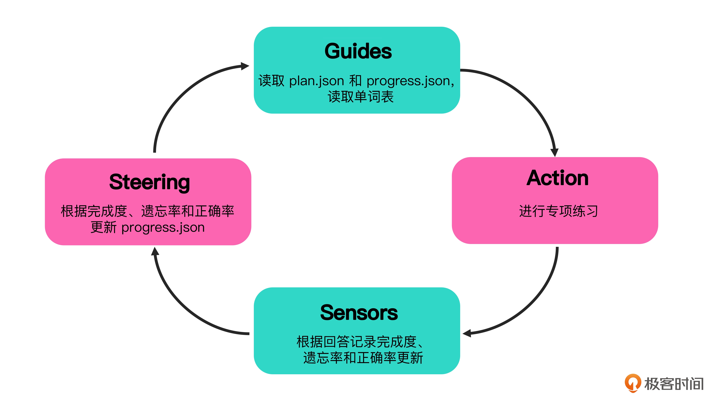

# 04｜封装技能：把操控循环装进 SKILL



上一讲我们通过背单词的例子，搭建了一个完整的 Harness。其中我们使用了三个技能（Skill）：背单词（vocab-drill）、动词变位（conjugation-drill）和数字表达（number-drill）。对正常使用来说，这个 Harness 已经可以工作了。但作为设计者，你可能还不太清楚这些技能内部到底长什么样。那么今天我们就来仔细看一看这些技能是怎么实现的。

**什么是技能技能**

就是把操控循环（Steering Loop）打包成一个可以重复使用的单元。在当前的 Agent 实践中，技能通常是一个文件夹，其常见结构如下所示：

``` bash
my-skill/ 
├── SKILL.md # 必需的：元数据 + 操控循环说明 
├── scripts/ # 可选的：工具代码 
├── references/ # 可选的：参考资料 
└── assets/ # 可选的：模板文件
``` 


技能的根目录下必须包含一份 SKILL.md 文件。这个文件是技能的指令子系统，我们需要把前馈（Guides）、行动（Action）、反馈（Sensors）和调整（Steer）四个环节用自然语言写清楚（这些概念你可以看 01 讲复习）。Agent 读到后就知道按照什么流程来执行任务。在背单词的 Harness 中，我们有背单词、动词变位和数字表达三个技能。它们存在于 skills 目录中。首先，让我们来看一下背单词的技能（它的指令系统位于 skills/vocab-drill/SKILL.md）：
``` bash
--- 
name: vocab-drill 
description: 教新词并定期复习，使用 FSRS 记忆曲线。每个单词独立记录状态。 
allowed-tools: 
 - _shared/fsrs_scheduler.py 
--- 

# vocab-drill —— 背单词 
从 `plans/vocab/week-NN.md` 读取本周词汇，从 `state/vocab/` 读写进度。 
学习方式为**造句拼写**：展示中文含义，并提供一个包含该单词的中文例句，让用户翻译， 
根据句子意思是否通顺、目标单词是否使用正确来评分。 
当 phase 为 review 时，跳过获取新词，只做 FSRS 复习。 

**Guides**：读取 `state/vocab/progress.json` 获取已学单词状态， 
调用 `get_due_cards` 获取到期复习单词，调用 `get_next_new_words` 获取今日新词。 
**Action**：先复习到期单词，再学新词。教学时展示目标单词的西语拼写、中文含义和一个例句。 
测验时，提供一个含该单词含义的中文句子，用户用西语提供**包含该单词的完整翻译**。 
**Sensors**：判分依据两条： 
1. 句子意思是否和中文含义匹配 
2. 目标单词是否在句子中正确使用（时态、搭配、拼写） 
评分分为「完全正确」「大致正确」「错误」。 
**Steering**：连续错误的单词进入强化模式（多展示 2 个例句并要求重写一次）。FSRS自动调整复习间隔。
```


我们可以清楚地看到这个 skill 的操控循环，也可以看到它和其他背单词软件的关键区别：并不在意单个单词的记忆，而是要在句子翻译中准确地使用这个单词。这主要是因为西班牙语的阴阳性、单复数以及各种变位规则非常复杂。单单记住一个单词作用实在有限。这里我们利用的就是大模型的推理能力，根据单词构造句子让使用者翻译，并判断翻译的准确程度。这样的功能很难利用传统编码的方式实现。接下来让我们看看这个 SKILL.md 文件的几个关键点。

**技能的元数据**

首先是 SKILL.md 的格式。SKILL.md 分为元数据和正文两个部分。文件开头 --- 之间的部分是 Skill 的元数据，是 Agent Skill 的标准格式。它包含三个字段：

- name：技能的唯一标识符，AGENTS.md 中编排层通过这个名字来引用这个技能。当我们加载 vocab drill 时，编排层实际上是根据这里的 name 来做匹配的；

- description：对技能的自然语言描述。编排层在选择技能时，会根据 description 判断当前任务是否匹配。比如 AGENTS.md 中写“背单词”，编排层就会比对所有技能的 description，找到与“背单词”语义匹配的那个；

- allowed-tools：声明这个技能依赖的外部工具，这是一个可选项。通常可以指定 Agent 系统的内建工具，或是我们自己提供的工具。这里的 _shared/fsrs_scheduler.py 是一个被三个技能共同使用的共享工具。当 Agent 加载这个技能时，它会知道需要将 fsrs_scheduler.py 中的函数注册为可用工具，供操控循环的各个环节调用。


我们这个背单词的 Agent 需要在规定时间内记忆一定数量的单词，并且保证记住而不是背过就忘，那就要按记忆曲线复习已学过的单词。因此，我们需要这个工具来帮我们规划记忆曲线来做复习。我们使用的是自由间隔重复调度算法，FSRS（FSRS，Free Spaced Repetition Scheduler），这个 _shared/fsrs_scheduler.py 就是实现了这个调度算法的工具包。


- get_due_cards：获取今天到期的复习条目；
- update_card：根据评分更新 FSRS 状态；
- get_stats：返回掌握率、遗忘率等统计数据；
- get_next_new_words：根据当前计划挑选今天的新词。

这是一个典型的计算型控制。FSRS 的间隔计算是确定性的，同样的输入产生同样的输出，不应该让大模型推理。这也生动地回答了前面章节提出的问题：什么逻辑应该放进工具、什么逻辑应该留在提示词中？推断型的判断大模型处理起来更有效率，比如翻译的是否有效，而计算型采用工具的方式更好。

**与工具子系统的交互**

有了工具定义，那么该如何使用这些工具呢？当然是在操控循环中与工具交互了。进入正文部分，你会发现操控循环的很多环节都需要工具子系统。比如在前馈部分：

```bash
读取 `state/vocab/progress.json` 获取已学单词状态， 
调用 `get_due_cards` 获取到期复习单词，调用 `get_next_new_words` 获取今日新词。
```

就明确说明要使用工具 get_due_cards 和 get_next_new_words 确定今天要做什么。当然，我们也可以不明确写出要调用什么工具，比如在反馈阶段：

```
**Steering**：连续错误的单词进入强化模式（多展示 2 个例句并要求重写一次）。FSRS自动调整复习间隔。
```

我们就没有告诉 Agent 到底要调用哪个工具来自动调整复习时间。这就要依靠 Agent 的推理能力了。其大致的推理链条是这样的：

``` bash
现在 Sensors 阶段结束了，我有了一个评分 
 -> Steering 阶段要求 FSRS 调整复习间隔 
 -> FSRS 要知道评分才能计算 
 -> 工具里有一个 update_card 函数，它的参数是 progress、word_id 和 rating  
 -> 我应该调用它，把评分传给 FSRS。
```

同样，对于前馈我们也可以完全依赖 Agent 的推理能力，获取当前状态和要学习的单词。只不过这里我选择给出另一种写法而已。顺便说一句，这种写法某种程度上能节约一点点词元（token），不过坏处就是一旦工具包里的内容改变了，还需要手动修改这里的引用的工具。因此绝大部分情况下，我们让 Agent 自己推断就好。

比如，前馈部分也可以写成：

```bash
**Guides**：根据当前进度，获取到期复习单词，以及今日要学习的新词。
```

那么，大模型大致会做如下的推理：

``` bash
现在的进度放在`state/vocab/progress.json` 
 -> Guides 要求获取到期复习单词 
 -> 工具里有一个 get_due_cards 函数，它的参数是 progress 
 -> 我应该调用它，把进度传给它; 
 -> 好，现在我知道当前要复习的单词了  
 -> Guides 还要求获取今日要学习的新词 
 -> 工具里有一个 get_next_new_words 函数，它的参数是 progress, plan 和 plan_dir 
 -> 我应该调用它，把进度传给它 
 -> 好，现在我知道要学习的新单词了
```


**与状态子系统的整合**

最后，也是最重要的。**就是与状态子系统的整合**。这是技能设计的重中之重，它决定了技能能否与外层 Harness 联动。Harness 的外层循环通过 plan.json 向技能下发当前周次和相关计划，技能通过 progress.json 向外层反馈每个单词的掌握情况。没有这个双向通道，技能就是孤立的。**状态子系统是内外两层之间的桥梁，它连接了内层操控循环和外层的 PDCA 循环：**

```bash
从 `plans/vocab/week-NN.md` 读取本周词汇，从 `state/vocab/` 读写进度。 
... 
**Steering**：连续错误的单词进入强化模式（多展示 2 个例句并要求重写一次）。FSRS自动调整复习间隔。
```

这里我们利用了 Agent 的自动推理能力。当 Agent 发现了 state/vocab/ 目录中的 plan.json 和 progress.json 后，就会通过自动推理理解其中状态的含义。同样，当我们说“FSRS 自动调整复习间隔”时，Agent 也能推断出，需要将修改的状态保存回 progress.json 中。

这个结构是我们当前 Harness 中技能的基本结构。让我们再看另外两个技能。先看数字表达练习的指令系统，位于 skills/numbers-drill/SKILL.md：

``` markdown
--- 
name: number-drill 
description: 数字表达练习。从 plans/numbers/ 读取本周范围，生成随机数字。 
allowed-tools: 
 - _shared/fsrs_scheduler.py 
--- 
# number-drill —— 数字表达 
从 `plans/numbers/week-NN.md` 读取本周数字范围，从 `state/numbers/` 读写进度。 
当 phase 为 review 时，跳过获取新词，只做 FSRS 复习。 
**Guides**：读取 `state/numbers/plan.json` 获取当前周，读取 `plans/numbers/week-NN.md` 
获取本周范围，调用 `get_due_cards` 获取到期卡片。在范围内生成随机数字。 
**Action**：展示数字，要求用西班牙语读出。答错时展示正确答案。 
**Sensors**：判分（完全正确/大致正确/错误），调用 `update_card` 更新 FSRS。 
**Steering**：FSRS自动调度。掌握后推进到下一周，第 4 周完成后进入纯复习模式。
```

动词变位练习的指令系统在 skills/conjugation-drill/SKILL.md：

``` markdown
name: conjugation-drill 
description: 动词变位练习。给出动词和时态，要求写出全部六个人称的变位。 
allowed-tools: 
 - _shared/fsrs_scheduler.py 
--- 
# conjugation-drill —— 动词变位 
从 `plans/conjugation/week-NN.md` 读取本周练习的动词和时态，从 `state/conjugation/` 读写进度。每个练习项目是一个动词+时态的组合。 
当 phase 为 review 时，跳过获取新词，只做 FSRS 复习。 
**Guides**：读取 `state/conjugation/progress.json`，调出到期项目或从本周计划中选新组合。 
**Action**：展示动词和时态，要求写出六个人称的变位。答错时展示正确形式。 
**Sensors**：判分。全对=完全正确，4-5个对=大致正确，≤3个对=错误。 
**Steering**：调用 `update_card` 更新 FSRS。连续错误的项目标记为待强化。
```

不难看出这三个技能的操控循环结构非常的相似：


无论我们要做的行动（Action）是什么，与外层循环的整合都是重中之重。这也是在采用双层循环 Harness 模型时，构造 Skill 的通用结构，即以状态子系统为核心来构造操控循环。

工具的实现

最后我们来讲一下工具的实现。我们知道工具有四个函数：

1. get_due_cards：获取今天到期的复习条目。服务于 Guides 阶段 。
2. update_card：根据评分更新 FSRS 状态。服务于 Sensors 到 Steering 的过渡 。
3. get_stats：返回掌握率、遗忘率等统计数据。服务于外层 PDCA 的 Check 
4. get_next_new_words：根据当前计划挑选今天的新词。服务于 Guides 阶段

如果你不会编程，或者不了解 FSRS 的具体用法，那要怎么实现这个工具并提供给 Agent 使用呢？实际上，你只需要用自然语言描述需求，大模型就会帮你设计函数名和实现。比如，你可以对 Agent 这样说：


> 我正在构建一个背单词的 Agent 系统。我需要一个 Python 工具，它的作用是使用记忆曲线算法，检查哪些单词今天该复习了。我有一份进度数据，每个单词记录了下一次复习日期和当前状态。如果当前日期已经到了或超过了复习日期，并且这个单词不是新词，就应该把它列为今天需要复习的条目。请帮我实现这个工具，并为需要使用这些工具的 Skill 生成使用说明。

特别注意的是最后一句，我们只需要把使用说明放入 allowed-tools 的说明中，就可以依赖 Agent 的推理能力完成对工具的调用了。比如，在 _shared/fsrs_scheduler.py 中开头的注释是这样的：

```  python
#!/usr/bin/env python3 
"""FSRS 记忆曲线调度器。三个技能共用。 
工具函数（由 SKILL.md 中的操控循环调用）： 
 get_due_cards(progress) — 今天到期的复习条目 
 update_card(progress, id, r) — 评分后更新记忆状态 
 get_stats(progress) — 掌握率、遗忘率 
 get_next_new_words(prog, pl, dir) — 挑选今日新词 
 init_new_words(prog, words, w) — 新词写入进度文件 
"""
```

所以其实并不需要我们来设计这个工具，大模型自己也可以帮助我们完成所有的工作。

**环境准备**
最后说一下环境准备。我们在上一讲简单提了一句。因为我的工具是通过 Python 实现的，那么我们就需要保证 Agent 的运行环境中包含我们需要的软件。比如我们的 FSRS 调度器就是依赖 fsrs 这个软件包实现的。而保证 Python 库一致的最简单办法就是通过 requirements.txt，列出所有 Python 依赖包。另一个就是初始化脚本 setup.sh，运行 pip install -r requirements.txt 安装依赖就可以了。这两个文件同样可以由大模型自动生成。你只需要在描述工具代码时顺带提一句“同时生成 requirements.txt 和 setup.sh”，大模型就会分析你的代码用到了哪些第三方库，自动生成对应的依赖列表和安装脚本。

**小结**

今天我们分析了背单词这个 Agent 系统中用的技能，以及它们是如何构造出来的。技能就是把操控循环打包成一个可以重复使用的单元。SKILL.md 是技能的指令子系统，包含元数据和正文两部分：元数据声明 name、description、allowed-tools，正文用自然语言写清楚前馈、行动、反馈、调整四个环节。我们也看到了技能与状态子系统的整合是技能设计的重中之重：外层循环通过 plan.json 下发计划和参数，技能通过 progress.json 反馈每个单词的掌握情况。没有这个双向通道，技能就是孤立的。以状态子系统为核心构造操控循环，是双层循环 Harness 模型下构造技能的通用结构。到此为止，我们就通过一个完整的例子，看到了 Harness 中包含的全部内容了。在有了这些具体的认知之后，下一讲，我们来讲一讲构造 Harness 的核心原则。

**思考题**
为什么 FSRS 记忆曲线的调度要放进工具（计算型控制），而不是写进 SKILL.md 让 Agent 自己推算？如果让 Agent 推算，会发生什么？

因为FSRS计算结果是确定的，相同的输入得到相同的输出，适合用工具实现（类似传统编程的大多数场景）。而用Agent推算，可能会导致结果随机，不稳定

